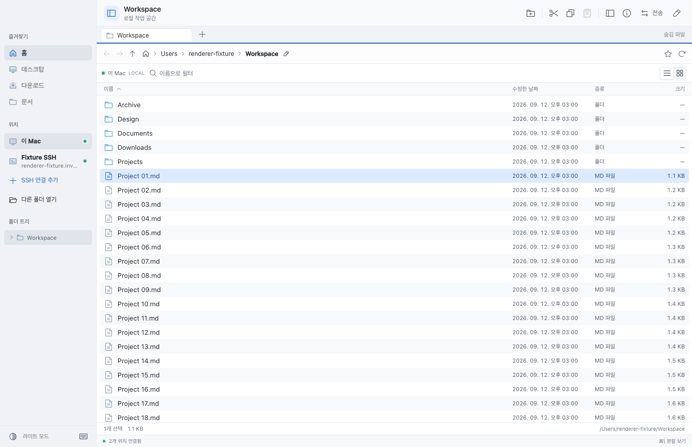

# Sinder

macOS 스타일로 로컬 파일과 SSH 서버를 함께 탐색하는 데스크톱 파일 관리자입니다. macOS를 우선 지원하며, 파일 경로와 OS 기능을 분리해 Windows/Linux로 확장할 수 있게 구성했습니다.



위 화면은 0.3의 실제 화면 코드에 검증용 파일 목록을 넣은 renderer 캡처입니다.

## 실행

Node.js 22.12 이상과 npm이 필요합니다.

```sh
npm install
npm run dev
```

`npm run dev`는 TypeScript와 화면을 빌드한 뒤 Electron 앱을 실행합니다. 소스를 변경한 후에는 앱을 종료하고 다시 실행하세요.

```sh
npm run build
npm start
npm run package
```

macOS 빌드 결과는 `release/mac-arm64/Sinder.app`입니다(Apple Silicon 기준). 현재 패키지는 개발용이며 배포용 Apple Developer 서명과 공증은 포함하지 않습니다. Windows 패키징 설정은 있으나 Windows에서의 실행 검증은 아직 진행하지 않았습니다.

빌드한 앱을 `~/Applications` 또는 `/Applications`에 복사하면 개발 서버 없이 실행할 수 있습니다. 외부 작업 볼륨이나 디스크 이미지에서 앱 시작이 지연되면 내부 디스크의 Applications 폴더에서 실행하세요.

## 사용

- 사이드바에서 로컬 폴더를 열거나 **SSH 연결 추가**로 서버를 등록합니다.
- **SSH 연결 추가 → 로컬 SSH 설정**에서 별칭을 선택하면 호스트·사용자·포트·키 경로를 자동 입력합니다. **모두 추가**는 서버 접속 없이 연결 목록에 저장하며 중복 추가를 막습니다. `Include`, 기본값, `ProxyCommand` 실행 파일과 `ProxyJump`도 지원합니다. [지원 범위](docs/SSH-CONFIG.md)를 참고하세요.
- SSH agent, 비공개 키(암호화 키 포함), 비밀번호 인증을 지원합니다. 첫 연결에서는 서버 지문을 확인합니다. 응답이 없는 연결은 **연결 취소**로 중단할 수 있습니다.
- `⌘ T`로 새 탭, `⌘ \\`로 분할 보기, `⌘ L`로 경로 입력을 사용합니다.
- 클릭으로 선택, `⌘` 클릭으로 개별 다중 선택, `Shift` 클릭이나 `Shift` + 방향키로 범위를 늘리고 줄입니다. 숨김·필터로 보이지 않게 된 항목은 선택에서 제외됩니다.
- `⌘ B`로 사이드바, `⌘ I`로 정보 패널을 여닫습니다. 표시 여부는 다음 실행에도 유지됩니다. 정보 패널은 처음에는 닫혀 있으며, 작은 창에서도 열 수 있습니다.
- `⌘ C / X / V`로 로컬과 서버 사이에서 복사·이동합니다. 패널이나 폴더로 드래그하면 복사하고, `Shift`를 누르면 이동합니다.
- 전송 패널에서 진행률과 오류를 확인하고 작업을 취소할 수 있습니다. 전송과 원격 편집 패널은 한 번에 하나씩 표시됩니다.
- 파일 전송에서 같은 이름은 **둘 다 유지**, **건너뛰기**, **충돌 시 중단** 중 선택합니다. 전송은 기존 파일을 덮어쓰지 않습니다.
- `F2`는 이름 변경, `⌘ Shift N`은 새 폴더, `⌘ .`은 숨김 파일입니다.
- `Space`나 파일 더블 클릭으로 텍스트·이미지 미리보기를 엽니다. 로컬 파일은 기본 앱으로 열고, 원격 파일은 원하는 로컬 폴더로 다운로드할 수 있습니다.
- 사이드바 폴더 트리는 방향키로 이동·펼치기·접기, `Enter`/`Space`로 폴더 열기를 지원합니다. 파일 목록의 `Shift F10`은 키보드 작업 메뉴를 엽니다. Finder/Explorer에서 파일을 Sinder 패널로 드래그해 가져올 수도 있습니다.
- 별 버튼으로 현재 폴더를 즐겨찾기에 추가합니다. 탭 위치, 즐겨찾기, 연결 프로필, 테마는 다음 실행에도 유지됩니다.
- `⌘ F`는 활성 패널의 **현재 폴더 이름 필터**로 이동합니다. `Escape`로 필터를 지우고 목록으로 돌아갑니다. 좁은 패널에서는 정렬 선택 메뉴로 모든 정렬 기준과 방향을 사용할 수 있습니다.
- 원격 연결을 다시 맺으면 해당 패널의 경로와 이동 기록을 유지합니다. 연결되지 않은 즐겨찾기를 열었을 때도 연결 후 요청했던 위치로 이동합니다.

Windows/Linux에서는 `⌘` 대신 `Ctrl`을 사용합니다. macOS는 `⌘ Backspace`, Windows는 `Delete`로 휴지통으로 이동합니다.

## 원격 파일 편집

원격 텍스트 파일의 미리보기에서 **원격 편집**을 누릅니다. 기본 편집기는 macOS TextEdit, Windows 메모장이며, 오른쪽 위 연필 버튼으로 여는 원격 편집 패널에서 다른 편집 앱이나 실행 파일을 선택할 수 있습니다. 32 MB 이하의 일반 파일을 지원합니다. 심볼릭 링크는 실제 파일 경로에서 편집하세요.

편집기가 **기존 파일 경로에 저장**하면 변경된 내용이 서버로 자동 반영됩니다. 임시 파일을 만든 뒤 이름을 바꾸는 편집기의 저장 방식도 감지합니다. ‘다른 이름으로 저장’으로 별도 경로에 만든 파일은 자동 업로드 대상이 아닙니다.

- **저장됨 / 저장 대기 / 서버에 저장 중**으로 반영 상태를 확인합니다.
- 연결이 끊기면 수정본을 이 기기에 보관합니다. 같은 서버와 계정으로 재연결하면 다시 확인하며, 앱을 닫은 동안 편집기가 저장한 내용도 다음 실행에서 감지합니다.
- 서버본도 변경되면 **버전 충돌** 상태로 멈춥니다. **서버본 별도로 열기**와 **내 수정본 열기**로 비교하고, 편집기에서 합친 뒤 **수정본 적용**을 선택합니다. 별도로 연 서버본은 비교용 복사본이며, 그 파일의 수정은 업로드하지 않습니다.
- **이전 서버본**을 펼치면 각 저장 전 버전을 탐색할 수 있습니다. 서버의 원본 폴더 안에 `.sinder-edit-<ID>/<원래 이름>`으로 보관하며 자동으로 삭제하지 않습니다. 보관본이 차지하는 공간은 사용자가 관리합니다.
- **일시 중지**하면 자동 반영을 멈추고 로컬 수정본은 유지합니다. **동기화 재개**로 다시 시작합니다.

로컬 수정본과 복구 기록은 앱 데이터의 `remote-edits/`에 저장합니다. macOS에서는 폴더 권한 0700, 파일 권한 0600으로 생성하며 암호화 저장소는 아닙니다. 백업 전에 서버 파일의 SHA-256 내용을 비교하고, 수정본의 업로드 결과도 확인합니다. 프로필의 호스트·포트·계정·호스트 키가 바뀌면 예전 수정본을 새 대상으로 전송하지 않습니다.

저장은 기존 서버본을 백업 이름으로 옮긴 뒤 수정본을 원래 이름으로 배치합니다. 두 이름 변경 사이에는 원래 경로가 잠시 없을 수 있습니다. 중간에 연결이 끊기거나 앱이 중단되면 재연결 시 기록을 읽어 원본을 복원하거나 이미 완료된 저장을 확인합니다. 서버의 다른 프로그램과 분산 잠금을 공유하는 기능은 아닙니다. ACL·확장 속성·소유권을 완전히 복제하는 편집 모드는 지원하지 않습니다.

## 삭제와 데이터 보호

로컬 항목은 OS 휴지통으로 이동합니다. 원격 항목은 서버 홈의 `.sinder-trash/<작업 ID>/<원래 이름>`에 보관하며 영구 삭제하지 않습니다. 이 경로에서 원래 위치로 이동하면 복원할 수 있습니다.

전송은 목적지의 `.sinder-*.partial`에 작성하고, 파일 크기 및 원본 메타데이터를 확인한 뒤 최종 이름으로 변경합니다. 폴더의 심볼릭 링크는 따라가지 않고 링크 자체를 복사합니다. 이동은 복사가 끝난 후 원본을 제거합니다. 취소/오류 시 진행 중인 임시 항목을 정리하며, 이미 완료된 개별 항목은 유지합니다. 연결 단절로 임시 파일을 정리하지 못하면 전송 오류에 정리 경로 안내를 표시합니다.

원본이 다른 프로그램에서 동시에 수정되는 경우를 가능한 범위에서 감지하지만, 파일 시스템 간 이동은 분산 트랜잭션이나 스냅샷이 아닙니다. 중요한 파일을 다른 프로그램이 계속 수정하는 동안에는 복사를 사용하세요. SFTP의 수정 시간 정밀도는 서버에 따릅니다. 링크의 대상 문자열과 파일의 기본 POSIX 권한을 유지하며 ACL, 확장 속성, macOS 리소스 포크는 복제하지 않습니다.

## 인증과 보안 구조

- renderer는 sandbox/context isolation을 사용하며 Node.js나 임의 IPC를 노출하지 않습니다.
- 메인 프로세스에서 모든 요청의 발신 frame과 입력을 검증합니다. 외부 페이지 이동과 새 창을 차단하고 CSP를 적용합니다.
- 파일 작업은 SFTP 프로토콜로 처리합니다. 파일 이름을 셸 명령에 넣지 않습니다.
- 비밀번호, 비공개 키 내용, 키 암호는 설정 파일에 저장하지 않습니다. 프로필에는 키 파일 경로만 저장합니다.
- 확인한 서버 키는 앱 전용 설정의 `hosts`에 저장하며, 키가 변경되면 자동 수락하지 않습니다.
- 설정은 Electron `userData` 폴더의 `settings.json`에 저장됩니다. macOS 기본 경로는 `~/Library/Application Support/Sinder`입니다.

참고한 공식 API 문서: [Electron 보안](https://www.electronjs.org/docs/latest/tutorial/security), [ssh2 Client](https://github.com/mscdex/ssh2), [SFTP API](https://github.com/mscdex/ssh2/blob/master/SFTP.md).

## 사용성 검토

0.3의 화면 밀도, 키보드 조작, 연결 취소와 코드 정리 결과는 [사용성 리뷰](docs/UX-REVIEW.md)에 기록했습니다.

## 검증

```sh
npm test
npm run test:e2e
```

`npm test`는 로컬 파일 작업과 **실제 OpenSSH 서버**를 통한 SFTP 전송을 검사합니다. 임시 키와 디렉터리를 만들고 `127.0.0.1` 임시 포트에만 테스트용 `sshd`를 띄웁니다. 사용자 SSH 설정이나 시스템 Remote Login 설정을 변경하지 않습니다. `/usr/sbin/sshd`와 `ssh-keygen`이 필요합니다.

`npm run test:e2e`는 Playwright로 Electron 창을 실행해 연결 폼·탐색·분할 보기·복사·이름 변경·검색·미리보기·테마·원격 편집·앱 재시작 복구를 검사합니다. 테스트 창은 임시 홈과 설정을 사용합니다. 네이티브 확인 창과 편집기 선택은 테스트에서 응답을 주입합니다. 편집 테스트는 무동작 실행 파일을 편집기로 지정하고 실제 캐시 파일에 저장하며, SSH 연결과 서버 파일 변경은 실제로 수행합니다. 화면 캡처는 `test-results`에 생성됩니다.

## 구조

```text
electron/providers.ts    로컬/SFTP 공통 파일 시스템
electron/connections.ts  SSH 수명 주기, 인증, 호스트 키
electron/transfers.ts    전송 큐, 스트리밍, 충돌, 취소
electron/remote-edits.ts 원격 편집 캐시, 자동 저장, 충돌, 복구 기록
electron/main.ts         Electron 창, 입력 검증, 제한된 IPC
electron/preload.cjs     renderer에 제공하는 명시적 API
shared/types.ts         위치, 항목, 연결, 전송 모델
electron/preview.ts      제한된 텍스트·이미지 미리보기
src/workspace.ts        탭·패널·이동 기록의 공통 상태 변경
src/selection.ts        선택 범위와 커서, 숨김 항목 제외
src/Pane.tsx            파일 탐색과 키보드 조작
src/App.tsx             탭, 분할 보기, 연결, 미리보기
```

SSH config/ProxyJump 가져오기, 재귀 검색, 큰 폴더 렌더링 최적화, 중단된 전송의 바이트 단위 재개, 배포용 코드 서명/공증은 후속 작업입니다.
