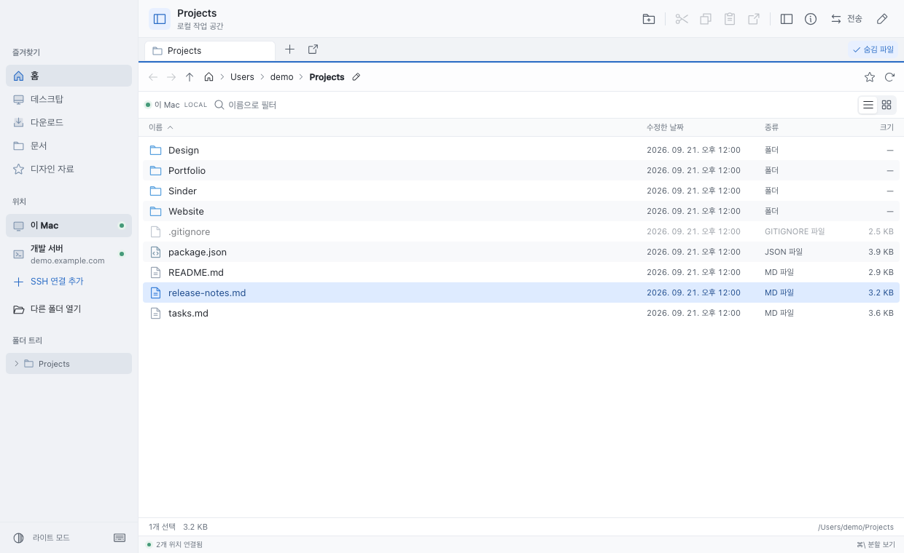
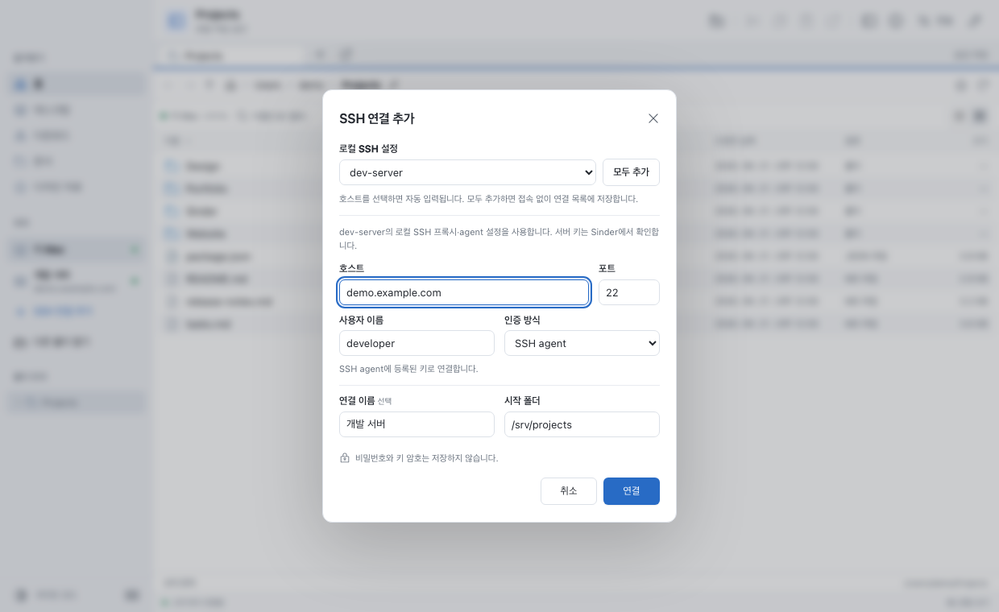
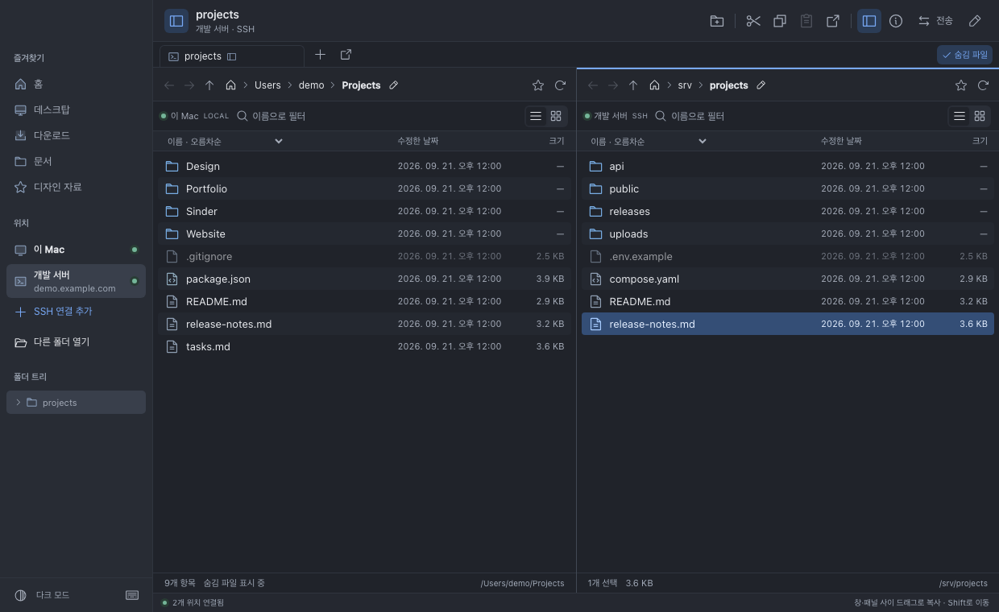

# Sinder

**내 Mac과 SSH 서버의 파일을 한곳에서 탐색하고, 옮기고, 편집하세요.**

Sinder는 로컬 폴더와 원격 서버를 함께 다루는 데스크톱 파일 관리자입니다. 여러 창과 탭을 열거나 화면을 둘로 나눠 작업할 수 있습니다. macOS를 우선 지원하며 Windows 지원을 위한 파일 경로·OS 기능 분리와 패키징 설정을 갖추고 있습니다.



## 시작하기

[macOS Apple Silicon용 0.5.1 프리뷰 다운로드](https://github.com/dev-jelly/sinder/releases/tag/v0.5.1)

ZIP을 내려받아 압축을 풀고 **Sinder.app**을 **응용 프로그램** 폴더로 옮긴 뒤 실행하세요. Developer ID 서명과 Apple 공증을 완료했으며 공증 티켓과 Gatekeeper 검증을 통과했습니다. Intel Mac·Windows 배포와 Windows 실기 검증은 아직 진행하지 않았습니다. 직접 빌드하려면 [소스에서 실행하기](#소스에서-실행하기)를 참고하세요.

앱을 열면 내 Mac의 홈 폴더가 표시됩니다. 사이드바의 **다른 폴더 열기**로 작업 폴더를 선택하세요. `⌘N`으로 새 창을, `⌘T`로 새 탭을 열 수 있습니다.

## 이미 쓰던 SSH 설정으로 연결하기

1. 사이드바에서 **SSH 연결 추가**를 누릅니다.
2. **로컬 SSH 설정**에서 평소 사용하는 호스트 별칭을 고릅니다. `~/.ssh/config`의 서버 주소·계정·포트·키 설정을 불러옵니다.
3. **연결**을 누르고 첫 연결의 서버 지문을 확인합니다.



설정이 없으면 서버 주소와 계정을 직접 입력해도 됩니다. SSH agent, 키 파일, 비밀번호 인증을 지원합니다. **모두 추가**는 접속하지 않고 연결 목록만 저장합니다. `Include`·`ProxyJump` 등 자세한 범위는 [SSH 설정 안내](docs/SSH-CONFIG.md)에 있습니다.

## 파일 복사와 이동

`⌘\`로 화면을 나누고, 양쪽에 원하는 폴더를 엽니다. 파일을 다른 패널이나 다른 Sinder 창으로 드래그하면 복사합니다. `Shift`를 누르고 놓으면 이동합니다. `⌘C / ⌘X / ⌘V`도 사용할 수 있습니다.



같은 이름의 파일은 기본적으로 **둘 다 유지**합니다. 전송 패널에서 진행률과 결과를 확인하고 취소할 수 있습니다.

### Finder와 함께 쓰기

- **가져오기:** Finder의 파일·폴더를 Sinder의 파일 목록 또는 폴더 위로 드래그합니다. 원격 패널에 놓으면 업로드합니다.
- **로컬 파일 꺼내기:** Sinder의 로컬 파일·폴더를 Finder로 드래그합니다.
- **원격 파일 꺼내기(macOS):** 원격 파일·폴더를 Finder에 바로 드래그합니다. 놓은 뒤 다운로드가 시작되고 완성된 사본이 목적지에 생깁니다. 서버 원본은 유지합니다. 다운로드가 끝날 때까지 Sinder를 열어 두세요.

전송 패널에서 다운로드 진행률과 오류를 확인할 수 있습니다. **Finder로 꺼내기** 버튼으로 사본을 먼저 준비한 뒤 대화상자의 **여기서 드래그** 영역을 사용할 수도 있습니다. 심볼릭 링크는 외부로 전달하지 않습니다. Windows에서는 **파일 탐색기로 꺼내기**로 먼저 다운로드하는 방식을 사용하며, Explorer와의 실기 호환성은 아직 확인하지 않았습니다.

현재 배포된 0.5.1에는 원격→Finder 복사가 대기 상태로 멈추는 문제가 있습니다. 0.5.2 소스에서 중복된 파일 쓰기 조정을 제거했으며, 수신 측 쓰기 조정과 실제 SSH 다운로드를 함께 재현한 회귀 테스트가 통과했습니다. 맥북의 별도 개발용 진단 창에서도 SSH 테스트 파일을 Finder로 드래그해 복사 성공과 전달 완료 로그를 확인했습니다. 수정 패키지의 서명·공증 및 배포 후 확인은 남아 있습니다. 배포 전까지는 Sinder의 로컬 패널로 먼저 복사해 사용할 수 있습니다.

## 파일을 바로 열고 편집하기

파일을 **더블 클릭**하거나 선택 후 `Enter`를 누릅니다. `Space`는 미리보기입니다.

| 파일 위치와 종류            | 여는 방식                                                       |
| --------------------------- | --------------------------------------------------------------- |
| 내 Mac의 파일               | 기본 앱에서 열기                                                |
| 서버의 텍스트·코드          | 지정 편집기에서 열기. 같은 파일에 저장하면 서버로 자동 반영     |
| 서버의 PDF·이미지·지원 문서 | 다운로드한 사본을 기본 앱에서 열기. 수정은 자동 업로드하지 않음 |

원격 텍스트 편집 중 연결이 끊기면 수정본을 이 Mac에 보관합니다. 서버 파일도 바뀌었으면 충돌 상태로 멈추고 두 버전을 비교할 수 있습니다. 오른쪽 위 연필 버튼에서 편집 상태와 편집기 설정을 확인하세요. [원격 편집과 복구 자세히 보기](docs/REFERENCE.md#원격-파일-편집)

## 자주 쓰는 단축키

| 동작                            | macOS              |
| ------------------------------- | ------------------ |
| 숨김 파일 표시·숨기기           | `⌘⇧N`              |
| 새 폴더                         | `⌘⌥N`              |
| 새 창 / 새 탭                   | `⌘N` / `⌘T`        |
| 분할 보기                       | `⌘\`               |
| 경로 입력 / 현재 폴더 이름 필터 | `⌘L` / `⌘F`        |
| 파일 열기 / 미리보기            | `Enter` / `Space`  |
| 복사 / 잘라내기 / 붙여넣기      | `⌘C` / `⌘X` / `⌘V` |
| 이름 변경 / 휴지통으로 이동     | `F2` / `⌘⌫`        |
| 사이드바 / 정보 패널            | `⌘B` / `⌘I`        |

숨김 파일 표시는 모든 Sinder 창에 적용되고 다음 실행에도 유지됩니다. 이전 단축키 `⌘⇧.`도 사용할 수 있습니다. Windows/Linux용 단축키는 `⌘` 대신 `Ctrl`, `⌥` 대신 `Alt`를 사용합니다.

## 파일과 로그인 정보는 어디에 저장되나요?

비밀번호와 키 암호는 설정 파일에 저장하지 않습니다. 로컬 삭제는 OS 휴지통을 사용하고, 원격 삭제는 서버 홈의 `.sinder-trash`에 보관합니다. 전송은 기존 파일을 덮어쓰지 않습니다.

원격 편집용 파일과 외부로 꺼내는 사본은 이 Mac의 앱 데이터 폴더에 저장됩니다. 자동 삭제하거나 암호화하는 저장소는 아닙니다. 전송의 권한·메타데이터 보존 범위, 백업, 복구 방식은 [상세 안내](docs/REFERENCE.md)에 설명되어 있습니다.

## 소스에서 실행하기

Node.js 22.12 이상과 npm이 필요합니다. macOS에서는 Finder 연동 모듈을 빌드할 Xcode Command Line Tools도 필요합니다(`xcode-select --install`).

```sh
git clone https://github.com/dev-jelly/sinder.git
cd sinder
npm ci
npm run dev
```

소스를 바꾼 뒤에는 앱을 종료하고 다시 실행하세요.

```sh
npm test          # 로컬 파일 작업 + 임시 OpenSSH 서버 통합 테스트
npm run test:e2e  # Electron 화면과 실제 파일 작업 검사
npm run package   # 개발용 macOS 앱 만들기
```

Apple Silicon의 개발용 앱은 `release/mac-arm64/Sinder.app`에 생성됩니다. 서명·공증된 공개 배포 빌드는 별도의 [배포 절차](docs/RELEASING.md)를 사용합니다.

README의 스크린샷은 현재 화면 코드에 공개용 데모 데이터를 넣어 촬영했습니다. 실제 사용자 파일이나 접속 정보는 포함하지 않으며, 네이티브 드래그 동작의 검증 자료는 아닙니다. `npx playwright install chromium` 후 `npm run screenshots`로 다시 만들 수 있습니다.

[상세 사용법·보안·개발 구조](docs/REFERENCE.md) · [SSH 설정](docs/SSH-CONFIG.md) · [개발 현황](docs/STATUS.md)
