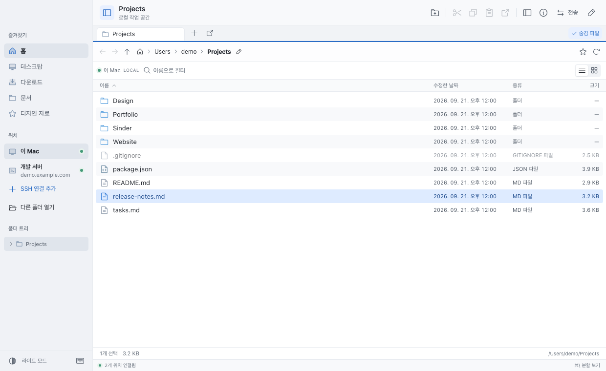
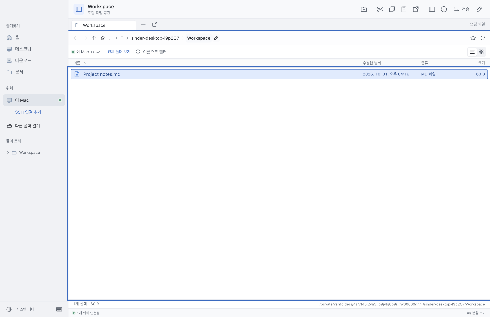
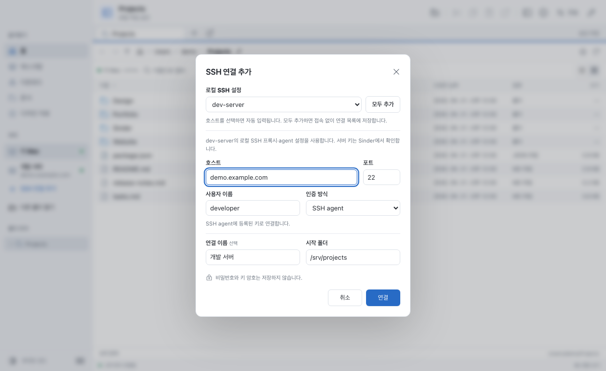
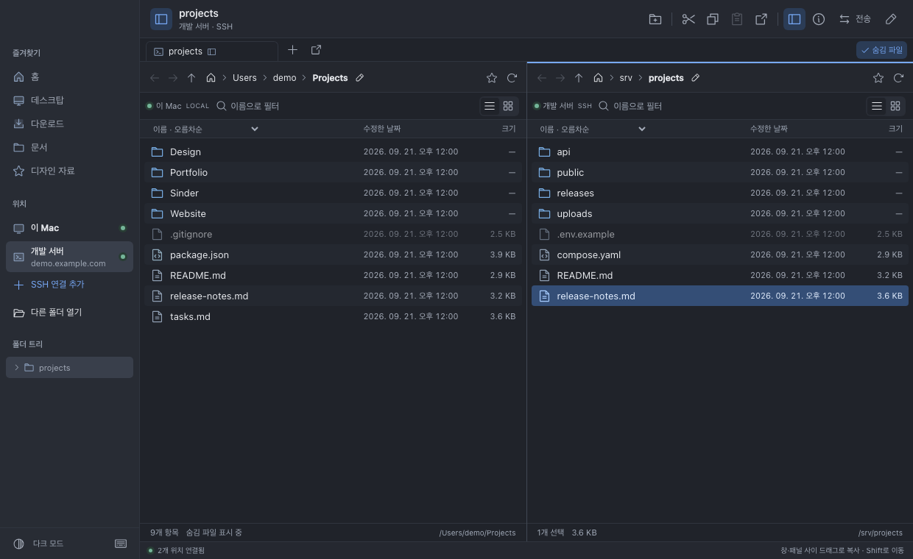

# Sinder

**내 Mac과 SSH 서버의 파일을 한곳에서 탐색하고, 옮기고, 편집하세요.**

Sinder는 로컬 폴더와 원격 서버를 함께 다루는 데스크톱 파일 관리자입니다. 여러 창과 탭을 열거나 화면을 둘로 나눠 작업할 수 있습니다. macOS를 우선 지원하며 Windows 지원을 위한 파일 경로·OS 기능 분리와 패키징 설정을 갖추고 있습니다.



## 시작하기

[macOS Apple Silicon용 0.5.3 프리뷰 다운로드](https://github.com/dev-jelly/sinder/releases/tag/v0.5.3)

ZIP을 내려받아 압축을 풀고 **Sinder.app**을 **응용 프로그램** 폴더로 옮긴 뒤 실행하세요. Developer ID 서명과 Apple 공증을 완료했으며 공증 티켓과 Gatekeeper 검증을 통과했습니다. Intel Mac·Windows 배포와 Windows 실기 검증은 아직 진행하지 않았습니다. 직접 빌드하려면 [소스에서 실행하기](#소스에서-실행하기)를 참고하세요.

업데이트할 때는 전송과 원격 편집 저장을 마친 뒤 Sinder를 `⌘Q`로 종료하고 앱을 교체하세요. 교체 후 Finder의 **응용 프로그램 → Sinder**에서 여세요. 다운로드·iCloud 폴더에 남아 있는 이전 사본이나 이를 가리키는 Dock 아이콘을 실행하지 않도록 주의하세요. [0.5.3 변경 내용과 검증 범위](https://github.com/dev-jelly/sinder/releases/tag/v0.5.3)

앱을 열면 내 Mac의 홈 폴더가 표시됩니다. 사이드바의 **다른 폴더 열기**로 작업 폴더를 선택하세요. `⌘N`으로 새 창을, `⌘T`로 새 탭을 열 수 있습니다.

## 0.5.4에 추가한 탐색 기능

현재 소스에는 다음 기능이 포함되어 있습니다. 0.5.4 공개 앱은 공증을 준비 중이며, 위 다운로드 링크는 0.5.3입니다.

- **파일 경로로 찾기:** `⌘L`로 경로 입력창을 열고 파일 경로를 입력하면 해당 파일 한 개를 표시하고 선택합니다. 로컬·SSH 파일, 확장자 없는 파일과 숨김 파일을 지원합니다. **전체 폴더 보기**로 일반 목록에 돌아갑니다.
- **기록 이동:** `⌘← / ⌘→` 또는 `Ctrl+← / Ctrl+→`, 마우스 뒤로·앞으로 버튼으로 활성 패널의 폴더 기록을 이동합니다. 텍스트 입력 중에는 방향키 단축키를 가로채지 않습니다.



## 이미 쓰던 SSH 설정으로 연결하기

1. 사이드바에서 **SSH 연결 추가**를 누릅니다.
2. **로컬 SSH 설정**에서 평소 사용하는 호스트 별칭을 고릅니다. `~/.ssh/config`의 서버 주소·계정·포트·키 설정을 불러옵니다.
3. **연결**을 누르고 첫 연결의 서버 지문을 확인합니다.



설정이 없으면 서버 주소와 계정을 직접 입력해도 됩니다. SSH agent, 키 파일, 비밀번호 인증을 지원합니다. **모두 추가**는 접속하지 않고 연결 목록만 저장합니다. `Include`·`ProxyJump` 등 자세한 범위는 [SSH 설정 안내](docs/SSH-CONFIG.md)에 있습니다.

## 파일 복사와 이동

`⌘\`로 화면을 나누고, 양쪽에 원하는 폴더를 엽니다. 파일을 다른 패널이나 다른 Sinder 창으로 드래그하면 복사합니다. `Shift`를 누르고 놓으면 이동합니다. `⌘C / ⌘X / ⌘V`도 사용할 수 있습니다.



같은 이름의 파일은 기본적으로 **둘 다 유지**합니다. 전송 패널에서 진행률과 결과를 확인하고 취소할 수 있습니다.

### Finder와 함께 쓰기

- **가져오기:** Finder의 파일·폴더를 Sinder의 파일 목록 또는 폴더 위로 드래그합니다. 원격 패널에 놓으면 업로드합니다.
- **로컬 파일 꺼내기:** Sinder의 로컬 파일·폴더를 Finder로 드래그합니다.
- **원격 파일 꺼내기(macOS):** 원격 파일·폴더를 Finder에 바로 드래그합니다. 놓은 뒤 다운로드가 시작되고 완성된 사본이 목적지에 생깁니다. 서버 원본은 유지합니다. 다운로드가 끝날 때까지 Sinder를 열어 두세요.

0.5.3에는 **뒤에 있는 창에서 드래그하기**를 추가했습니다. 비활성 Sinder 창의 파일을 드래그할 때 창을 앞으로 올리지 않아 목적지 창을 가리지 않도록 개선했습니다. 드래그하지 않고 클릭하면 마우스 버튼을 놓을 때 창이 활성화됩니다. 네이티브 창 동작의 자동 검사는 통과했으며, 실제 Finder와 창을 겹친 상태의 드래그는 추가 실기 확인이 필요합니다.

전송 패널에서 다운로드 진행률과 오류를 확인할 수 있습니다. **Finder로 꺼내기** 버튼으로 사본을 먼저 준비한 뒤 대화상자의 **여기서 드래그** 영역을 사용할 수도 있습니다. 심볼릭 링크는 외부로 전달하지 않습니다. Windows에서는 **파일 탐색기로 꺼내기**로 먼저 다운로드하는 방식을 사용하며, Explorer와의 실기 호환성은 아직 확인하지 않았습니다.

0.5.2는 원격→Finder 복사가 대기 상태로 멈추는 문제를 수정한 프리뷰입니다. 수신 측 쓰기 조정과 실제 SSH 다운로드를 함께 재현한 회귀 테스트가 통과했고, 맥북의 별도 개발용 진단 창에서도 SSH 테스트 파일의 Finder 복사와 전달 완료 로그를 확인했습니다. 배포 앱은 Developer ID 서명과 Apple 공증을 완료했습니다. 실제 사용 서버와 여러 파일·폴더의 드래그는 추가 실기 확인을 진행하고 있습니다.

## 파일을 바로 열고 편집하기

파일을 **더블 클릭**하거나 선택 후 `Enter`를 누릅니다. `Space`는 미리보기입니다.

| 파일 위치와 종류            | 여는 방식                                                       |
| --------------------------- | --------------------------------------------------------------- |
| 내 Mac의 파일               | 기본 앱에서 열기                                                |
| 서버의 텍스트·코드          | 지정 편집기에서 열기. 같은 파일에 저장하면 서버로 자동 반영     |
| 서버의 PDF·이미지·지원 문서 | 다운로드한 사본을 기본 앱에서 열기. 수정은 자동 업로드하지 않음 |

원격 텍스트 편집 중 연결이 끊기면 수정본을 이 Mac에 보관합니다. 서버 파일도 바뀌었으면 충돌 상태로 멈추고 두 버전을 비교할 수 있습니다. 오른쪽 위 연필 버튼에서 편집 상태와 편집기 설정을 확인하세요. [원격 편집과 복구 자세히 보기](docs/REFERENCE.md#원격-파일-편집)

## 자주 쓰는 단축키

| 동작                            | macOS              |
| ------------------------------- | ------------------ |
| 숨김 파일 표시·숨기기           | `⌘⇧N`              |
| 새 폴더                         | `⌘⌥N`              |
| 새 창 / 새 탭                   | `⌘N` / `⌘T`        |
| 분할 보기                       | `⌘\`               |
| 경로 입력 / 현재 폴더 이름 필터 | `⌘L` / `⌘F`        |
| 파일 열기 / 미리보기            | `Enter` / `Space`  |
| 복사 / 잘라내기 / 붙여넣기      | `⌘C` / `⌘X` / `⌘V` |
| 이름 변경 / 휴지통으로 이동     | `F2` / `⌘⌫`        |
| 사이드바 / 정보 패널            | `⌘B` / `⌘I`        |

숨김 파일 표시는 모든 Sinder 창에 적용되고 다음 실행에도 유지됩니다. 이전 단축키 `⌘⇧.`도 사용할 수 있습니다. Windows/Linux용 단축키는 `⌘` 대신 `Ctrl`, `⌥` 대신 `Alt`를 사용합니다.

## 파일과 로그인 정보는 어디에 저장되나요?

비밀번호와 키 암호는 설정 파일에 저장하지 않습니다. 로컬 삭제는 OS 휴지통을 사용하고, 원격 삭제는 서버 홈의 `.sinder-trash`에 보관합니다. 전송은 기존 파일을 덮어쓰지 않습니다.

원격 편집용 파일과 외부로 꺼내는 사본은 이 Mac의 앱 데이터 폴더에 저장됩니다. 자동 삭제하거나 암호화하는 저장소는 아닙니다. 전송의 권한·메타데이터 보존 범위, 백업, 복구 방식은 [상세 안내](docs/REFERENCE.md)에 설명되어 있습니다.

## 소스에서 실행하기

Node.js 22.12 이상과 npm이 필요합니다. macOS에서는 Finder 연동 모듈을 빌드할 Xcode Command Line Tools도 필요합니다(`xcode-select --install`).

```sh
git clone https://github.com/dev-jelly/sinder.git
cd sinder
npm ci
npm run dev
```

소스를 바꾼 뒤에는 앱을 종료하고 다시 실행하세요.

```sh
npm test          # 로컬 파일 작업 + 임시 OpenSSH 서버 통합 테스트
npm run test:e2e  # Electron 화면과 실제 파일 작업 검사
npm run package   # 개발용 macOS 앱 만들기
```

Apple Silicon의 개발용 앱은 `release/mac-arm64/Sinder.app`에 생성됩니다. 서명·공증된 공개 배포 빌드는 별도의 [배포 절차](docs/RELEASING.md)를 사용합니다.

README의 스크린샷은 현재 화면 코드에 공개용 데모 데이터를 넣어 촬영했습니다. 실제 사용자 파일이나 접속 정보는 포함하지 않으며, 네이티브 드래그 동작의 검증 자료는 아닙니다. `npx playwright install chromium` 후 `npm run screenshots`로 다시 만들 수 있습니다.

[상세 사용법·보안·개발 구조](docs/REFERENCE.md) · [SSH 설정](docs/SSH-CONFIG.md) · [개발 현황](docs/STATUS.md)
